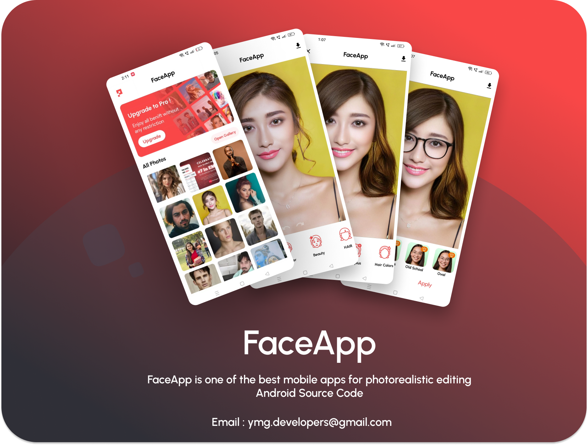

# FaceApp-Android-Studio-Source-Code

## FaceLab: AI Face Editor App

FaceLab is the ultimate beard photo editor and aging face app for photos. With features like the face scan hairstyle app and the ability to see what you might look like as you age, it's perfect for anyone looking to have fun with their photos!

### Features:
- **Beard Photo Editor**: Style your beard with ease!
- **Aging Face App**: See how you might look in the future.
- **Smile App**: Add a smile to any photo.
- **Face Shape Detector**: Find your ideal hairstyle.
- **Photo Lab Camera**: Capture and edit in one go.
- **HD Photo Editing**: Enjoy high-quality edits.

Whether you're looking to edit photos for fun or to find your perfect style, FaceLab has everything you need!

### Screenshot

### Contact
For inquiries, please reach out via email: [ymg.developers@gmail.com](mailto:ymg.developers@gmail.com)

---

Feel free to modify the features or any other section as needed!
